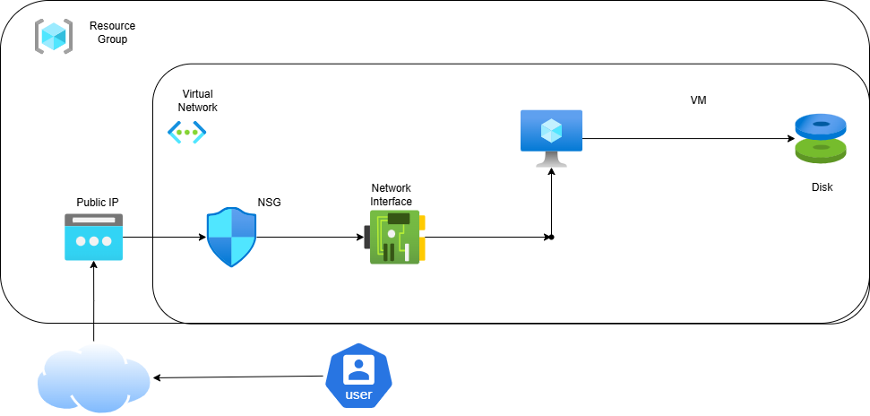

<<<<<<< HEAD
# Azure Adminstrator Az104 Project
=======
# Simple VM Creation on Azure Portal

This diagram and guide show how to create a basic Virtual Machine in the Azure Portal.

## 📌 Architecture Overview
The VM creation process involves the following components:

1. **Azure Portal** – User interface to deploy resources
2. **Resource Group** – Logical container for Azure resources
3. **Virtual Network (VNet)** – Provides private networking for resources
4. **Network Interface (NIC)** – Connects the VM to the VNet and assigns an IP address
5. **Public IP** – Allows inbound and outbound communication over the internet
6. **Network Security Group (NSG)** – Controls inbound and outbound traffic to the NIC or subnet
7. **Virtual Machine (VM)** – The compute resource running the OS

### 🔹 Diagram:

---

## 🚀 Steps to Create a VM in Azure Portal

1. **Login to Azure Portal**
   - Go to [https://portal.azure.com](https://portal.azure.com)
   - Sign in with your credentials

2. **Create a Virtual Machine**
   - Go to Dashboard and click on create Resource
   - Search "Virtual Machines"
   - Click **+ Create → Azure virtual machine**
   - Fill in:
     - Resource Group: (Select existing or create new)
     - VM Name: (e.g., `DemoVM`)
     - Region: (e.g., East US)
     - Image: (e.g., Windows Server 2022 Datacenter)
     - Size: (e.g., B1s)
     - Authentication: (Password or SSH key)
	 - Public inbound ports : Allow
	 - Select inbound ports: SSH (22) for linux  HTTP (80) or HTTPS (443) for windows
  
   - Click **Review + Create** → **Create**

4. **Access the VM**
   - Once deployment completes, go to the VM page
   - Click **Connect**
   - Use the **Public IP** with RDP (Windows) or SSH (Linux) to log in

---

## 🛠 Tools Used
- **Draw.io (diagrams.net)** – For architecture diagram
- **Azure Portal** – For VM deployment
- **GitHub** – For documentation hosting
- **git** - For version control system GitHub uses. And keeping track of every change you make in GitHub.

---

## 📚 Resources
- [Azure Virtual Machine Documentation](https://learn.microsoft.com/en-us/azure/)
- [Draw.io Online Tool](https://app.diagrams.net)

---
>>>>>>> 9ddc09d ( Initial commit - Azure simple VM creation project)
