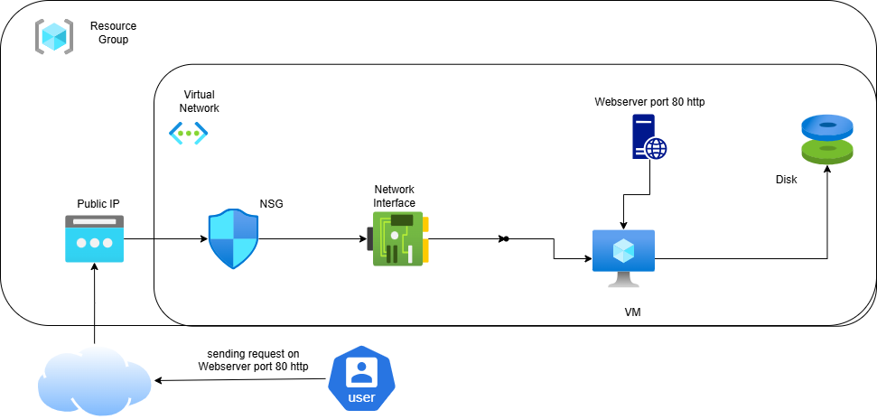

# Azure Linux VM Creation & Web Server Installation using Azure Portal

## 1. Objective
This guide explains how to:
1. Create a Linux Virtual Machine (VM) in Azure using the Azure Portal.
2. Install and configure a web server (Apache or Nginx) on the VM.
3. Configure Azure Network Security Group (NSG) rules to allow HTTP access.

---

## 2. Prerequisites
- Active **Azure subscription**.
- Access to **Azure Portal**: [https://portal.azure.com](https://portal.azure.com)
- SSH client installed:
  - **Windows**: Use Git Bash or PowerShell.
  - **Linux/macOS**: Built-in terminal.

---

## 3. Steps

### Step 1: Login to Azure Portal
- Open [https://portal.azure.com](https://portal.azure.com)  
- Sign in with your Azure account.

---

### Step 2: Create a New Linux VM
1. **Create a resource** → Search for **Virtual Machine** → **Create**.
2. **Basics Tab**:
   - **Subscription**: Select your subscription.
   - **Resource Group**: Create new or select existing (e.g., `RG-LinuxDemo`).
   - **VM Name**: `Linux-VM`.
   - **Region**: Choose the nearest location.
   - **Image**: `Ubuntu Server 20.04 LTS` (or later).
   - **Size**: `B1s` or as per requirement.
   - **Authentication type**: 
     - **SSH public key** (recommended) or 
     - **Password** (for quick testing).
   - **Username**: Set a Linux username (e.g., `azureuser`).
3. **Inbound Ports**: Allow **SSH (22)** and **HTTP (80)** during VM creation.
4. Click **Next** through tabs until **Review + Create**.
5. Click **Create** to deploy.

---

### Step 3: Configure NSG Rules to Allow HTTP
If you did not allow HTTP (80) during VM creation:
1. In Azure Portal, go to your VM → **Networking**.
2. Under **Network security group**, click the NSG linked to your VM.
3. Go to **Inbound security rules** → **Add**.
4. Configure:
   - **Source**: Any
   - **Source port ranges**: `*`
   - **Destination**: Any
   - **Destination port ranges**: `80`
   - **Protocol**: TCP
   - **Action**: Allow
   - **Priority**: 100 (or next available number)
   - **Name**: Allow-HTTP
5. Click **Add** to save the rule.

---

### Step 4: Connect to the VM via SSH
- **If using SSH key:**
```bash
ssh -i /path/to/private-key.pem azureuser@<Public-IP>

- **If using password authentication:**
		ssh azureuser@<Public-IP>

---

### Step 5: Install Web Server
Option 1: Apache HTTP Server
sudo apt update
sudo apt install apache2 -y
sudo systemctl enable apache2
sudo systemctl start apache2

Option 2: Nginx
sudo apt update
sudo apt install nginx -y
sudo systemctl enable nginx
sudo systemctl start nginx


### Step 6: Test Web Server
http://<Public-IP>

## 4. Architecture Diagram




---


## 5. Clean-Up


When done testing:

Stop the VM to avoid costs.

Delete the resource group to remove all resources.
