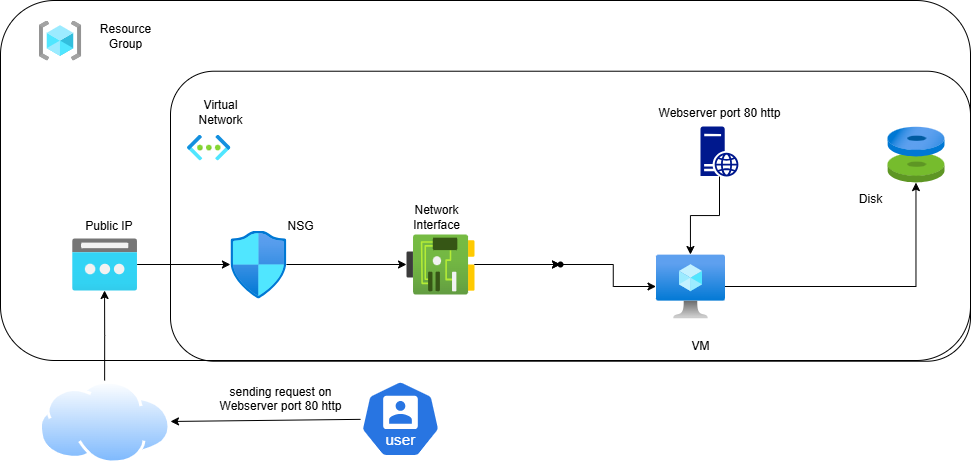

# Azure Windows Server VM Creation & IIS Installation using Azure Portal

## 1. Objective
This guide explains how to:
1. Create a Windows Server Virtual Machine (VM) in Azure using the Azure Portal.
2. Install and configure Internet Information Services (IIS) on the VM.
3. Configure Azure Network Security Group (NSG) rules to allow HTTP access.

---

## 2. Prerequisites
- Active **Azure subscription**.
- Access to **Azure Portal**: [https://portal.azure.com](https://portal.azure.com)
- Remote Desktop Protocol (RDP) client installed:
  - **Windows**: Built-in Remote Desktop Connection.
  - **Mac**: Microsoft Remote Desktop (download from App Store).

---

## 3. Steps

### Step 1: Login to Azure Portal
- Open [https://portal.azure.com](https://portal.azure.com)  
- Sign in with your Azure account.

---

### Step 2: Create a New Windows VM
1. **Create a resource** → Search for **Virtual Machine** → **Create**.
2. **Basics Tab**:
   - **Subscription**: Select your subscription.
   - **Resource Group**: Create new or select existing (e.g., `RG-WindowsDemo`).
   - **VM Name**: `Windows-IIS-VM`.
   - **Region**: Choose the nearest location.
   - **Image**: `Windows Server 2019 Datacenter` (or later).
   - **Size**: `B2s` or as per requirement.
   - **Username / Password**: Set for RDP login.
3. **Inbound Ports**: Allow **RDP (3389)** and **HTTP (80)** during creation.
4. Click **Next** through tabs until **Review + Create**.
5. Click **Create** to deploy.

---

### Step 3: Configure NSG Rules to Allow HTTP
If you did not allow HTTP (80) during VM creation:
1. In Azure Portal, go to your VM → **Networking**.
2. Under **Network security group**, click the NSG linked to your VM.
3. Go to **Inbound security rules** → **Add**.
4. Configure:
   - **Source**: Any
   - **Source port ranges**: `*`
   - **Destination**: Any
   - **Destination port ranges**: `80`
   - **Protocol**: TCP
   - **Action**: Allow
   - **Priority**: 100 (or next available number)
   - **Name**: Allow-HTTP
5. Click **Add** to save the rule.

---

### Step 4: Connect to the VM via RDP
1. In Azure Portal, go to your VM resource.
2. Click **Connect → RDP**.
3. Download the `.rdp` file and open it.
4. Enter the credentials you created during VM setup.
5. Accept the certificate warning to connect.

---

### Step 5: Install IIS
#### Option 1: Using Server Manager
1. Open **Server Manager**.
2. Click **Manage → Add Roles and Features**.
3. Select **Web Server (IIS)** role.
4. Click **Install** and wait for completion.

#### Option 2: Using PowerShell
```powershell
Install-WindowsFeature -name Web-Server -IncludeManagementTools

---

### Step 6: Test Web Server
http://<Public-IP>


## 4. Architecture Diagram



---


## 5. Clean-Up


When done testing:

Stop the VM to avoid costs.

Delete the resource group to remove all resources.
